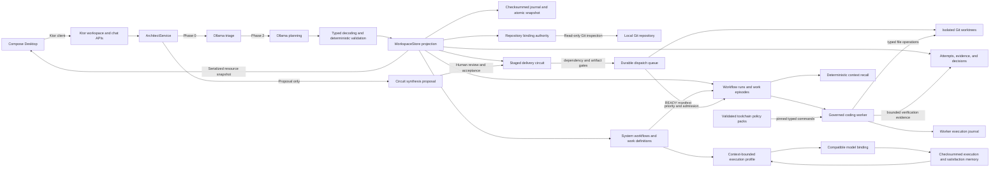

# Orchard

**Plant intent, harvest software.**

Orchard is a local-first engineering workspace for turning natural-language intent into governed, evidence-producing software workflows. Its current MVP combines a Compose Desktop project center, a Ktor backend, deterministic workflow validation, and local inference through Ollama.

> **Project status:** Milestone 9.4 complete - Guided Product Genesis. Orchard now forces product experience, first-epic architecture, repository blueprint, and explicit admission before implementation authority opens.

## Milestone 9.4: Guided Product Genesis

The desktop application is now one state-driven Architect circuit rather than a freely navigable delivery dashboard. Conversation forms candidate structure while the backend determines the only legal next transition and the screen continuously projects durable product truth.

Delivered and verified:

- A guided `CLASSIFICATION -> EXPERIENCE -> ARCHITECTURE -> BLUEPRINT -> ADMISSION -> READY` circuit.
- Greenfield-local, existing-local, and organization-governed project classification.
- Existing-local repository binding inside the guided flow; organization-governed admission fails closed pending verified policy sources.
- A structured Experience Contract covering audience, product promise, primary journey, interaction principles, emotional qualities, exclusions, and accessibility commitments.
- First-epic selection as the experience-proving vertical slice before architecture and repository setup.
- Structured components and ADR-like decisions correlated to requirements, dependencies, and repository paths.
- A repository blueprint derived from design, including toolchain, modules, policy packs, and verification commands.
- Bounded local-model genesis proposals that remain candidate data until explicit human application.
- Checksummed append-only genesis revisions with stale-write rejection and exact restart recovery.
- Production workflow admission that rejects manual and durable-dispatch starts until genesis is admitted.
- A stable Compose workspace with a non-clickable progress spine, semantic phase transitions, conversational proposal review, precise fallback controls, and live architecture projection.
- Adversarial tests proving a model cannot skip phases, forge revision authority, mutate state through proposal generation, or bypass the dispatch interlock.

Milestone 9.4 boundaries:

- The desktop shell projects one active local project; multi-client and remote Architect protocols remain later work.
- Repository blueprints are admitted authority but are not yet materialized into new repositories.
- Structured architectural decisions are not yet exported as repository Markdown ADRs.
- Revising an admitted genesis and computing downstream invalidation remains a later conversational change circuit.

## Milestone 1: Local Architect MVP

This milestone establishes Orchard's first complete local workflow: describe delivery intent in the desktop application, interpret it with `phi3:mini`, validate it against deterministic Kotlin policy, and render the resulting hierarchy without a cloud service.

Delivered and verified:

- Compose Desktop project, epic, story, task, and bug views.
- Multiline Architect input with Ctrl+Enter submission.
- Typed Ktor APIs and `kotlinx.serialization` JSON contracts.
- Two-phase local Ollama triage and planning through a suspendable Ktor client.
- Request-local Architect execution with single-flight concurrency protection.
- Deterministic preservation of explicit titles, descriptions, and parent IDs.
- Atomic plans of up to eight ordered operations.
- Default Delivery hierarchy enforcement: `Project -> Epic -> Story -> Task/Bug`.
- Automatic `General` epic creation when a new project and story omit an epic.
- Kotlin-owned IDs, hierarchy normalization, and rollback.
- Local application directories beneath `~/.orchard`.
- Backend and frontend regression suites run through `./gradlew build`.
- Live Ollama verification covers non-streaming JSON requests and exact single-intent creation.

Milestone 1 boundaries:

- Workspace state holds at most 32 entities in process memory.
- Create is the only applied action; update, delete, and query are classified but rejected.
- Ollama must be running locally with `phi3:mini` installed.
- Evidence derivation and downstream agent execution begin after this milestone.

## Milestone 2: Filesystem Authority

Workspace state now has a human-readable authority beneath `~/.orchard/projects/workspace`. The in-memory store is a validated projection recovered at backend startup.

Delivered and verified:

- One checksummed JSONL journal transaction per accepted Architect batch.
- Monotonic transaction sequences and entity IDs across backend restarts.
- Checksummed, human-readable JSON snapshots after 32 transactions.
- Temporary-file writes, flushes, and atomic snapshot replacement.
- Recovery from a snapshot plus later journal transactions.
- Quarantine of a malformed or truncated journal tail while preserving the valid prefix.
- Full hierarchy validation before recovered entities enter the in-memory projection.
- In-memory rollback and a structured `503` response when durable commit fails.
- API snapshots expose only committed entities while a batch is in progress.

Milestone 2 boundaries:

- The current authoritative schema covers the 32-item Default Delivery workspace.
- Database, vector, and embedding state beneath `~/.orchard/db` remains derived and rebuildable.
- Corrupt authoritative snapshots fail startup rather than silently discarding state.

## Milestone 3: Repository Binding

An Orchard Project can now bind to a real local Git repository. The binding is durable authority, while branch, remote, working-tree state, availability, and build-system metadata are refreshed from the repository when the workspace is read.

Delivered and verified:

- Directory selection from the active Project in Compose Desktop.
- Backend validation of absolute, existing directories inside Git worktrees.
- Canonical normalization to the Git top-level directory.
- Checksummed, atomically replaced `repository-bindings.json` authority keyed by Project ID.
- Live branch, origin remote, clean/dirty state, and build-system inspection.
- Gradle, Maven, Meson, CMake, Cargo, and Node build-system detection.
- Missing or moved repositories remain bound and report unavailable without losing project state.
- Read-only Git commands with optional index locking disabled.
- Structured `404`, `422`, and `503` repository-binding outcomes.
- Restart recovery and desktop/backend contract tests.

Milestone 3 boundaries:

- Orchard never fetches, checks out, stages, commits, or writes configuration in a bound repository.
- A Project has at most one active local repository binding.
- Repository metadata is context, not accepted completion evidence.
- Lifecycle transitions and evidence contracts begin in Milestone 4.

## Milestone 4: Governed Workflow Memory

Starting a Task or Bug creates an immutable workflow admission record rather than directly changing a board status. Orchard pins the complete work-item hierarchy and clean repository revision, resolves the built-in task or bug workflow, recalls relevant past work episodes, and durably publishes the run before projecting the item as In Progress. Attempts, evidence, decisions, cancellation, and completion are append-only workflow events.

Delivered and verified:

- Workflow runs with monotonic IDs and checksummed JSONL persistence.
- Immutable context manifests containing Project, Epic, Story, Task/Bug, workflow version, and exact Git revision.
- Separate task and bug evidence contracts; bug work additionally requires regression-test evidence.
- Deterministic Project/type/workflow-scoped recall of up to three similar work episodes.
- Recalled problems, failed approaches, successful resolutions, evidence summaries, and source revisions embedded in the historical run.
- Clean-worktree admission and rejection of missing bindings, unavailable repositories, unborn `HEAD`, duplicate starts, and unsupported entity types.
- Persist-before-publish semantics: a failed append leaves the item in Todo with no visible run.
- Typed attempt and evidence records attached to admitted runs.
- Git validation that evidence targets a real descendant revision with source changes from the pinned context.
- Deterministic gate decisions from evidence kind, command, exit code, producer, revision, and output hash.
- Passing retries supersede earlier failed evidence for the same gate without erasing the failed attempt.
- Event-derived `EVIDENCE_PENDING`, `EVIDENCE_BLOCKED`, `DONE`, and `CANCELLED` run states and board projections.
- Atomic completion decisions and immutable work episodes containing failed approaches, the accepted resolution, evidence summaries, and source revision.
- Compose controls showing run state, pinned revision, gate progress, recalled precedent, and explicit cancellation.
- Restart recovery preserves the original context even when the repository advances to a later revision.
- A real-Git regression completes one Task, restarts the store, and proves a similar Task recalls the generated episode.

Milestone 4 boundaries:

- Orchard records evidence supplied by agents, CI, or other trusted producers; it does not execute build or test commands from evidence payloads.
- Retry appends new evidence to the same run. Cross-run supersession and review approval are not yet modeled.
- Cancellation closes a run without manufacturing a completion episode.
- Approved project practices and repository instructions are not yet resolved into context manifests.

## Milestone 5: System Workflows

System workflows govern how Orchard work becomes eligible for delivery. A Task or Bug no longer starts merely because it exists and has a clean repository. Its latest definition revision must be `READY`, and the accepted manifest is embedded in the resulting delivery run.

Delivered and verified:

- Versioned built-in Task and Bug definition workflows with explicit phases.
- One generic step contract for start conditions, recalled context, allowed executors, evidence, and transition signals.
- Structured definitions for requested outcome, current and required behavior, bounded scope, non-goals, constraints, and acceptance criteria with verification methods.
- Bug-specific reproduction and regression obligations.
- Deterministic `NEEDS_INVESTIGATION`, `NEEDS_CLARIFICATION`, `NEEDS_SPLIT`, and `READY` assessments.
- Append-only, checksummed `work-definitions.jsonl` authority with monotonic definition IDs and per-item revisions.
- Latest-revision semantics: a later ambiguous revision blocks delivery even if an earlier revision was ready.
- Delivery admission rejects missing or non-ready definitions and closes definition revision after delivery starts.
- New delivery runs embed the exact accepted definition manifest and hash.
- Definition-derived `ACCEPTANCE` evidence gates augment the source, build, test, and Bug regression obligations.
- Every evidence result and cancellation emits a typed transition signal selected from the pinned step policy.
- Desktop definition editor and card-level readiness projection; Start Workflow is offered only at `READY`.
- Real-Git restart coverage proves definitions, pinned runs, acceptance gates, completion episodes, and recall recover together.

### Milestone 6: Collaborative Work Definition authority

Tasks and Bugs now support an iterative human-LLM definition loop before delivery:

- invoke the local model from the work item or definition editor
- inspect model observations separately from assumptions
- record human feedback as a durable artifact
- ask the model for a feedback-aware revision
- edit any proposal into a distinct human-authored revision
- explicitly accept a proposal before deterministic assessment

The workflow step declares actor-specific authority. HUMAN may propose, revise, provide feedback, and accept. LOCAL_LLM may only propose and revise. DETERMINISTIC_POLICY alone assesses completeness and derives the transition signal.

All proposals, revisions, feedback, acceptance records, source hashes, and model provenance are append-only and recovered after restart. Delivery pins the accepted proposal and closes further definition collaboration.

Milestone 6 boundaries:

- Humans currently supply and revise definitions through the desktop or typed API.
- Orchard validates explicit structure and unresolved questions; it does not claim to infer every latent ambiguity from prose.
- `NEEDS_SPLIT` records proposed child titles but does not yet materialize child work items.
- Investigation agents may later gather logs, diagnostics, and reproductions, but their outputs remain observations until accepted through a system workflow.

### Milestone 7: Context-Bounded Model Profiles

The Work Definition workflow now requests `bounded-definition-reasoning-v1` instead of naming a model. Orchard resolves a compatible installed binding and compiles one immutable invocation envelope containing the current workflow step, allowed and forbidden actions, required output schema, and authoritative context.

Delivered and verified:

- Versioned execution profiles separate reasoning requirements from model identity.
- Model bindings declare context capacity, capabilities, provider, inference configuration, and optional digest.
- The definition profile uses a conservative 12,000-token input aperture and reserves 2,000 output tokens.
- Mandatory context overflow fails before inference; Orchard never silently truncates workflow authority.
- Ollama receives an explicit output-token cap and returns prompt/completion token telemetry when available.
- Every attempted inference appends checksummed execution evidence with envelope, prompt, and output hashes, token counts, latency, and schema validity.
- LLM proposal provenance pins the exact execution ID.
- Human feedback, unchanged acceptance, and edited acceptance become distinct satisfaction observations derived from their authoritative journals.
- Capability profiles are rebuilt from raw evidence and show sample count, schema validity, human outcomes, edit distance, median latency, and confidence.
- Sparse routing selects the smallest compatible binding; sufficiently sampled bindings are ordered by schema reliability, human acceptance, unchanged acceptance, and latency.
- Compose Desktop displays the matching model-memory evidence in the collaborative definition editor.
- Restart and torn-tail tests prove the profile projection recovers from the valid journal prefix; interior corruption fails closed without deleting later evidence.

Milestone 7 boundaries:

- Profile memory influences executor selection only; it cannot signal `READY`, accept a definition, or complete a workflow.
- Pre-inference token counting is a conservative estimate until providers expose tokenizer-specific counting.
- The production installation currently binds the definition profile to local `phi3:mini`; multi-binding routing is implemented and tested through provider contracts.
- Satisfaction currently derives from feedback and acceptance behavior rather than a general rating control.
- Generic benchmarks, leaderboards, fine-tuning, and autonomous code execution remain separate work.

### Milestone 7.1: User-Configurable Model Apertures

Model execution defaults remain versioned workflow policy, while local users can now override the operating aperture according to their machine and task needs.

Delivered and verified:

- Checksummed, atomically replaced `model-profile-settings.json` local authority.
- Separate input aperture and output reasoning reserve controls.
- Optional preferred binding or evidence-aware automatic routing.
- Save-time validation that input plus output fits an installed binding's declared context capacity.
- Ollama explicitly requests the effective input-plus-output aperture rather than its theoretical maximum.
- Workflow-owned reasoning class and required capabilities cannot be overridden.
- Typed model-profile GET/PUT APIs with `404`, `422`, and `503` outcomes.
- Desktop settings dialog showing defaults, effective budgets, installed models, and live draft compatibility.
- Effective budgets and preferred binding apply to the next definition execution without restarting Orchard.
- Capability evidence remains separated by effective aperture, model digest, and inference configuration.
- Restart coverage proves the selected aperture and binding preference recover from disk.

Milestone 7.1 boundaries:

- Declared model context capacity remains the binding compatibility constraint; live admission is governed separately by Milestone 7.2.
- A smaller aperture never truncates mandatory context. It produces explicit context-budget overflow when the invocation cannot fit.
- The desktop currently updates overrides but does not delete the override record; using default budgets restores the default aperture behavior.

### Milestone 7.2: Resource-Aware Parallel Admission

Orchard now combines theoretical model demand, actual machine availability, and user-owned capacity policy before every production local-model invocation.

Delivered and verified:

- Checksummed, atomically replaced `machine-usage-policy.json` authority.
- User-configurable Orchard capacity share from 1% to 100%, minimum free-memory reserve, and maximum concurrent model jobs.
- Live Linux host memory, JVM CPU-load, processor, and process-relative cgroup v2/v1 memory telemetry.
- Most-restrictive cgroup ancestor limits and cgroup usage included in available-capacity calculations.
- Deterministic leases requiring demand to fit both the delegated share of total capacity and live availability after the safety reserve.
- Overflow-safe cumulative RAM and CPU reservations; unknown telemetry fails closed.
- Conservative Ollama demand derived from model residency plus KV-cache aperture, with explicit one-thread execution matching the CPU lease.
- Separate `429` capacity/concurrency outcomes and `503` telemetry/storage outcomes.
- Resource-admission evidence attached to model execution observations without invalidating pre-7.2 journals.
- Per-ticket execution locks permit independent tickets to run concurrently while preventing duplicate inference for one ticket.
- Architect triage and planning use the same Orchard-wide resource policy as Work Definition execution.
- Typed machine-resource GET/PUT APIs and desktop controls showing observed memory, CPU load, active leases, and the latest admission decision.
- Desktop requests can overlap; response ordering prevents stale snapshots from replacing newer state.

Milestone 7.2 boundaries:

- GPU/VRAM placement, thermal pressure, and accelerator-specific utilization are not yet admission inputs.
- The Ollama memory estimate is deliberately conservative and does not yet subtract shared resident-model memory across leases.
- Capacity denial returns a retryable result; a durable autonomous queue and worktree-aware integration scheduler remain the next delivery layer.
- CPU enforcement is achieved by explicit Ollama thread limits and admission reservations, not by Orchard-created cgroups.

### Milestone 8.0: Staged Delivery Circuits

Orchard now records logical execution order before admitting parallel ticket work. Epic plans organize Stories; Story plans organize Tasks and Bugs. The graph is durable authority, while labels such as `1a`, `1b`, and `2a` are derived for people.

Delivered and verified:

- Complete direct-child coverage for Epic-to-Story and Story-to-Task/Bug plans.
- Strict backward dependency wires that reject missing, duplicate, self, same-stage, and forward edges.
- Versioned stage workflow registry for contract design, parallel implementation, integration, and sequential delivery policies.
- Runtime resolution of stage workflow pins; unknown IDs and versions are rejected.
- Story-level typed output declarations and input requirements tied to exact producer nodes and delivery evidence kinds.
- Evidence-backed artifact instances binding producer, workflow run, accepted evidence ID, repository revision, and output hash.
- Downstream admission requires both completed dependencies and every declared artifact instance.
- Append-only checksummed plan authority with monotonic IDs, file locking, forced writes, and restart recovery.
- Single-backend optimistic concurrency through active revision and hash tokens, with stale editor submissions returning `409 Conflict`.
- Historical revision recovery across hierarchy growth, with current coverage enforced against the active revision.
- Explicit cancelled-node retry without permanently locking the circuit.
- Desktop Epic and Story planning actions, registered workflow selection, circuit lanes, eligibility, and artifact signals.
- Bounded stages, nodes, dependencies, and artifact collections at the authority boundary.

Milestone 8.0 boundaries:

- Plans are manually constructed and accepted; automatic Architect decomposition and materialization are future work.
- Eligible nodes are started explicitly; durable automatic dispatch, priorities, and worktree-aware integration queues are future work.
- Stage workflows orchestrate circuit entry and exit. Task and Bug runs retain their own governed delivery workflows and evidence contracts.
- Orchard persists evidence-bound artifact identity, not arbitrary artifact payload bytes.
- Epic circuits currently use completion dependencies only; Epic artifact wires await an explicit Story-output aggregation policy.
- Built-in stage workflows are versioned policy; installing user-authored workflow implementations is not yet supported.
- One Orchard backend process owns each workspace authority directory; cross-process stale-conflict classification is outside this milestone.

### Milestone 8.1: Architect Circuit Synthesis

Orchard can now ask the local Architect to decompose an existing Epic or Story into a reviewable staged circuit proposal. Generation remains proposal-only: deterministic validation and explicit human acceptance are still required before a graph becomes execution authority.

Delivered and verified:

- Dedicated `bounded-circuit-synthesis-v1` reasoning profile with configurable input and output apertures.
- Immutable synthesis envelopes containing exact hierarchy, accepted definitions, valid evidence kinds, active plan base, and registered stage workflows.
- Strict JSON output for stages, nodes, dependency wires, typed artifact signals, observations, and assumptions.
- Deterministic post-generation validation of complete membership, workflow pins, graph ordering, artifact contracts, and authority bounds.
- Append-only checksummed `circuit-proposals.jsonl` authority with monotonic IDs, revisions, model provenance, and restart recovery.
- Model execution evidence for success, invalid output, provider failure, resource denial, token overflow, and cancellation.
- Stale-context rejection when hierarchy or active plan authority changes during inference.
- Proposal-only generation API and a separate explicit acceptance API.
- Desktop generation from Epic and Story planners, visible observations and assumptions, and editable proposal fields.
- Accepted plans pin the source proposal ID and hash and distinguish unchanged acceptance from human-edited acceptance.
- Structural edit-distance evidence feeds model capability memory and future binding selection.
- Cross-journal recovery validates model execution, proposal provenance, and accepted plan references together.

Milestone 8.1 boundaries:

- Synthesis organizes existing children; it does not materialize new Stories, Tasks, or Bugs.
- Epic synthesis emits completion dependencies only until Story output aggregation has an explicit authority model.
- Regeneration appends a new proposal; feedback-threaded circuit revisions and proposal history UX remain future work.
- The existing profile API can configure synthesis apertures, while the desktop settings dialog currently focuses on the primary Work Definition profile.
- Generation does not start eligible nodes. Durable queues, automatic dispatch, worktree isolation, and integration ownership belong to Milestone 8.2.

### Milestone 8.2: Durable Circuit Dispatch

Orchard now turns accepted circuit eligibility into durable execution authority. A node is recorded before its workflow starts, survives restart or temporary repository denial, and remains traceable to the exact plan revision that authorized it.

Delivered and verified:

- Append-only checksummed `circuit-dispatches.jsonl` authority with monotonic IDs, forced writes, and structural restart recovery.
- Idempotent reconciliation from accepted plan, hierarchy, READY Work Definition, dependency, artifact, and stage-policy authority.
- Deterministic dispatch priorities derived from stage and node order.
- Automatic initial workflow starts and evidence-driven downstream fan-out without model judgment.
- A one-second production scheduler that retries pending nodes after transient repository admission failure.
- Immutable workflow context binding to the exact dispatch ID.
- Real Git worktrees and `orchard/circuit-dispatch-*` branches pinned to the admitted clean base revision.
- Distinct isolated workspaces for parallel nodes.
- Exactly one owner node for every `integration-v1` stage and a pinned integration-mode workspace reservation.
- Derived pending, running, done, and cancelled views without mutating dispatch authority.
- Explicit cancelled-node replacement with a new dispatch, workflow run, branch, and worktree.
- Typed desktop projection of queue priority, runtime state, integration ownership, and workspace reservation.
- Filesystem-level worktree tests, restart idempotency tests, scheduler retry tests, cancellation tests, and dependency fan-out tests.

Milestone 8.2 boundaries:

- Dispatch creates the governed workflow run and isolated workspace consumed by the Milestone 9.2 coding worker.
- The integration owner receives an isolated workspace but Orchard does not yet merge, rebase, resolve conflicts, or publish branches.
- Dispatch worktrees and branches are retained; governed archival and cleanup are future work.
- Priority is deterministic circuit order rather than a configurable deadline or scheduling class.
- Local-model resource leases now govern coding inference as well as definition and circuit synthesis.
- Epic circuits gate Story completion; Task and Bug dispatch comes from Story circuits until Story-output aggregation is defined.
- The scheduler is single-backend authority, not a distributed multi-process queue.

### Milestone 9.0: Requirement Authority and Design Admission

Orchard now treats design and requirement decomposition as enforceable system authority. Governance is explicitly activated per Project; activated projects fail closed when implementation authority is absent or stale, while legacy projects preserve their existing workflow until migrated.

Delivered and verified:

- Exact Epic system, Story subsystem, and Task/Bug implementation requirement levels.
- Stable requirement IDs, direct-parent traceability, and complete direct-parent allocation.
- Immutable candidate design revisions with optimistic revision and content-hash concurrency.
- Deterministic design admission with structured, immutable rejection findings.
- Atomic admission and criterion-level acceptance-contract compilation.
- Exact design and parent-design references, inherited requirement IDs, verification methods, and human or automated gates in each contract.
- Append-only checksummed `design-governance.jsonl` authority with forced writes and monotonic IDs.
- Restart recovery that recomputes deterministic findings, design hashes, decision hashes, parent references, and acceptance contracts.
- Manual and circuit-dispatched execution gates that require current admitted Task/Bug authority.
- Immutable workflow contexts that pin the complete acceptance contract.
- Stale-descendant impact projection when a new Epic or Story design is admitted.
- Historical stability for already-started runs under their original pinned contract.
- Typed HTTP operations for project activation, candidate recording, and deterministic admission.

Milestone 9.0 boundaries:

- Deterministic admission proves structure, traceability, allocation, and executable acceptance paths; independent semantic inspection is still required to prove non-weakening, feasibility, and policy consistency.
- The external organizational Git policy source defined in ADR 004 is not yet synchronized or applied.
- Acceptance criteria are pinned into workflow context; criterion-level completion enforcement is delivered in Milestone 9.1.
- A dedicated Compose design-authoring and admission screen remains future UX work; authority is available through the typed backend API and workspace snapshot.
- Parent revisions report stale descendants but do not synthesize replacement child designs.

### Milestone 9.1: Contract-Compiled Acceptance Gates

Orchard now carries admitted requirement authority through completion. Every criterion in the Task or Bug acceptance contract becomes an immutable gate in the resolved workflow, and all built-in, Work Definition, automated criterion, and human criterion gates must pass against one resulting repository revision.

Delivered and verified:

- Version 3 governed delivery workflows compiled from the pinned acceptance contract.
- Stable criterion evidence kinds derived from admitted criterion IDs.
- Exact requirement and criterion traceability in each compiled gate.
- Automated criteria that accept only their admitted verification command and passing revision evidence.
- Human criteria that reject command evidence and require immutable named judgments with rationale.
- Rejected and superseding approved judgments retained in append-only workflow history.
- Completion decisions that pin every contributing evidence and judgment event ID.
- Same-revision composition across source, build, test, Work Definition, automated, and human gates.
- Work episodes containing accepted evidence summaries and human approval rationale.
- Replay validation that rejects invalid criterion, contract, verification, authority-reference, or completion claims.
- Replay-time Git ancestry and outcome revalidation rather than trust in persisted revision strings or pass flags.
- Recoverable-tail quarantine for workflow run, event, and episode journals, with interior corruption still failing closed.
- Typed run projections for `PENDING`, `REJECTED`, and `PASSED` criterion gates.
- Backend and desktop network contracts for recording and inspecting human judgments.

Milestone 9.1 boundaries:

- External producers may still submit evidence; Milestone 9.2 adds Orchard-owned bounded local verification without claiming OS-level sandbox isolation.
- Workflow evidence recovery fails closed when the bound repository or referenced commits are unavailable for ancestry revalidation.
- Named approvers are attributable caller claims, not yet authenticated identities or policy-role proofs.
- Quorum, delegation, segregation of duties, and time-bounded waivers require the policy-composition layer.
- A dedicated Compose judgment control remains future UX work.
- External policy-pack synchronization and source-bound RAG are the next governance arc.

### Milestone 9.2: Governed Autonomous Coding Worker

Orchard now closes the first local execution loop. A circuit-dispatched governed run can be durably claimed, translated by a bounded local model into typed file operations, committed in its reserved Git worktree, verified, and submitted to the existing acceptance-gate engine.

Delivered and verified:

- Append-only checksummed `coding-worker.jsonl` claims and results with monotonic IDs, forced writes, cross-process append locking, restart validation, and torn-tail recovery.
- Claims pinned to run context hash, isolated worktree, model-binding fingerprint, and bounded attempt number before inference.
- `bounded-coding-patch-v1` model profile with strict JSON full-file `WRITE` and `DELETE` proposals.
- Bounded tracked-file context assembly with model execution, resource admission, token, schema, and output provenance.
- Clean-worktree admission, normalized path confinement, symlink and metadata rejection, atomic writes, `git diff --check`, and local candidate commits.
- Run-authority revalidation immediately before mutation to prevent writes after cancellation or context change.
- Argument-vector verification using only pinned commands or validated toolchain policy defaults, with reduced environment, timeout, process-tree termination, and bounded output.
- Evidence submission exclusively through the Milestone 9.1 gate engine; the worker cannot approve human criteria or mark a run complete.
- Canonical Git source-diff hashes re-proved during replay for new worker evidence.
- Bounded immutable repair attempts, persisted cooldowns for transient resource denial, interrupted-claim recovery, and no repeat execution while a completed candidate awaits human judgment.
- Automatic one-second worker scheduling plus typed execution-history and manual-tick APIs.
- Focused real-Git tests for journal replay, duplicate claims, path escape, dirty-index contamination, candidate commits, command execution, and canonical diff hashing.

Milestone 9.2 boundaries:

- Candidate branches are not merged, rebased, pushed, published, conflict-resolved, archived, or cleaned up automatically.
- Verification is bounded but not isolated by an OS filesystem/network sandbox; repository build scripts remain trusted local code.
- The first proposal format replaces complete UTF-8 files rather than applying semantic or language-server edits.
- The production binding remains `phi3:mini`; a code-specialized local binding can be routed later through the coding profile.
- Context assembly uses bounded lexical ranking over tracked text files; source-bound RAG and symbol-aware retrieval remain future work.
- A dedicated Compose coding-worker surface remains part of the upcoming UX effort.

### Milestone 9.3: Runtime Toolchain Policy Packs

Orchard now separates toolchain declarations from its trusted execution engine. Built-in and user-installed packs describe repository detectors and typed build/test commands, while Kotlin continues to enforce filesystem, process, evidence, and replay invariants.

Delivered and verified:

- Strict version 1 JSON schema for pack identity, profile priority, file detectors, evidence kinds, executables, and argument vectors.
- Built-in Gradle, Maven, Cargo, Meson, CMake, and Node profiles moved out of the coding gateway into a resource policy pack.
- Hot discovery of external packs from `~/.orchard/policy-packs/toolchains/*.json` on every future policy resolution.
- Deterministic selection by descending priority, then stable pack and profile identity.
- Fail-closed validation of schema versions, duplicate identities, bounds, traversal, reserved roots, malformed executables, and command arguments.
- Bounded policy-directory scanning, pack-file reads, and streaming verification-output capture.
- Typed command execution without shell expansion or a hard-coded ecosystem executable registry.
- Repository-local executable confinement with regular-file, no-symbolic-link, and executable checks.
- Durable worker claims pinning the selected pack ID, pack version, profile ID, and complete policy hash before inference.
- Exact acceptance-contract commands retaining precedence and exact evidence text while executing as typed arguments.
- Tests proving a previously unknown community toolchain can be added after catalog construction and used without restart or backend code changes.
- Legacy coding-worker journal replay retained across the new policy authority fields.

Milestone 9.3 boundaries:

- External packs are local user-installed execution policy; Orchard does not fetch or activate remote packs automatically.
- Git source allowlisting, revision synchronization, signatures, and a community registry remain future policy-source work.
- Only toolchain verification is pack-backed. Stage workflows, delivery contracts, model catalogs, prompt registries, and classifiers remain subsequent migrations.
- Pack commands are bounded argv, not shell scripts, but repository builds still lack an OS-level filesystem/network sandbox.
- Pack selection is detector-based and not yet exposed as an explicit per-Project UI setting.

## Architecture



Orchard has two Gradle modules:

- `frontend`: Compose Desktop UI, ordinary Compose state, and a typed Ktor client.
- `backend`: Ktor servers, Architect orchestration, workflow policy, durable workspace authority, and the Ollama client.

The backend exposes:

- `GET http://127.0.0.1:8085/api/workspace`
- `POST http://127.0.0.1:8086/api/architect/chat`
- `POST http://127.0.0.1:8085/api/work-items/{id}/runs`
- `POST http://127.0.0.1:8085/api/work-items/{id}/definitions`
- `POST http://127.0.0.1:8085/api/workflow-runs/{id}/attempts`
- `POST http://127.0.0.1:8085/api/workflow-runs/{id}/evidence`
- `POST http://127.0.0.1:8085/api/workflow-runs/{id}/cancel`
- `GET http://127.0.0.1:8085/api/coding-worker/executions`
- `POST http://127.0.0.1:8085/api/coding-worker/tick`

The chat request is `{ "prompt": "..." }` with a 4092-byte UTF-8 limit. Both APIs return the same resource envelope, including non-success chat responses such as `409`, `422`, and `503`.

## Key Decisions

| Area | Decision |
| --- | --- |
| Runtime | Use conventional Kotlin, Ktor, coroutines, and serialization. |
| UI | Use Compose state and lifecycle-aware client disposal. |
| LLM | Treat Ollama output as untrusted input that must pass typed decoding and deterministic validation. |
| Multi-intent | Let the model propose at most eight operations; Kotlin assigns IDs and commits or rolls back the batch. |
| Authority | Keep hierarchy and workflow policy outside the model. |
| Storage | Make human-readable filesystem records authoritative; indexes and embeddings are derived. |
| Repository | Bind canonical local Git roots by Project ID and inspect them without mutation. |
| Workflow memory | Pin immutable context, derive lifecycle state from events, and recall scoped completed work. |
| System workflows | Require a versioned Ready Work Definition and derive acceptance evidence before delivery admission. |
| Workflow runtime | Execute system and delivery policy through the same start, context, executor, evidence, and signal contract. |
| Prompts | Keep system prompts as versioned resources. |
| Coding worker | Treat model output as typed candidate operations; Orchard owns worktree mutation, verification, evidence, and retry authority. |

See [docs/adrs](docs/adrs) for the decision history and proposed filesystem intelligence, workflow, and model-routing architecture.

## Requirements

- Linux, macOS, or Windows with a Compose Desktop-compatible environment.
- JDK 23 recommended. Kotlin `2.1.21` falls back to JVM target 23 when run with JDK 26.
- `curl` for the combined launcher readiness check.
- Git available on the local `PATH` for repository binding and inspection.
- Ollama on `127.0.0.1:11434` with `phi3:mini` installed.

## Run

Launch the complete application:

```bash
./run_orchard.sh
```

Or start each module separately.

Start the backend:

```bash
./gradlew :backend:jvmRun --no-daemon
```

Start the desktop application in another terminal:

```bash
./gradlew :frontend:desktopRun --no-daemon
```

Compile and test without launching:

```bash
./gradlew build --no-daemon
```

Example creation sequence:

```text
Create a project named Aurora.
Create an epic named Authentication in project ID 1.
Create a story named Email sign-in in epic ID 2.
Create a task named Implement login form in story ID 3.
```

Dependent entities can be created atomically:

```text
Create a project named Atlas, create a story named Import market data, and create two tasks named Parse feed and Validate sequence numbers.
```

The Default Delivery workflow materializes this as `Atlas -> General -> Import market data -> Parse feed / Validate sequence numbers`. A validation failure rolls back the entire plan.

## Local Data

Backend startup creates the directory structure:

```text
~/.orchard/
|-- db/
|-- projects/
|   `-- workspace/
`-- rag-shared/
```

These directories are runtime state and are not part of the repository. Accepted batches append to `workspace.journal.jsonl`; compaction adds `workspace.snapshot.json`. Guided product-genesis revisions append to `project-genesis.jsonl`. Project bindings are stored in `repository-bindings.json`. System workflow revisions append to `work-definitions.jsonl`. Workflow admissions append to `workflow-runs.jsonl`; attempts, evidence, decisions, and cancellations append to `workflow-events.jsonl`; completed historical episodes append to `work-episodes.jsonl`. Corrupt journal tails are moved beside their source as timestamped `*.corrupt-*.jsonl` files.

## Next Milestones

- Materialize admitted greenfield repository blueprints and add explicit local candidate promotion without remote pushes.
- Add conversational successor revisions that explain and enforce downstream invalidation after admitted product changes.
- Export structured architectural decisions as correlated repository ADRs while retaining Orchard authority identity.
- Add verified external Git policy sources with allowlisted identity, signed revisions, manifests, freshness limits, and onboarding attestations.
- Define an open policy-pack format so communities can publish engineering standards, assurance packs, inspectors, and acceptance templates that organizations compose with stricter private overlays.
- Build source-bound local RAG only from verified policy commits; retrieval remains a disposable navigation projection and every passage retains repository, revision, path, range, and content-hash provenance.
- Add an Investigation Center whose agents gather provenance-backed logs, diagnostics, reproductions, and requirement proposals for declared system-workflow phases.
- Derive project observations, candidate practices, and executable project workflows from evidence.
- Add review approval, cross-run supersession, repository instruction resolution, and evidence-based model routing.
- Implement concrete classifier, chunker, embedder, and vector-index adapters.