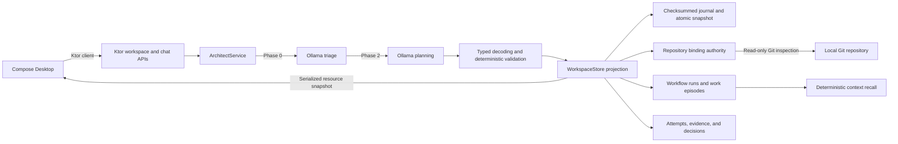

# Orchard

**Plant intent, harvest software.**

Orchard is a local-first engineering workspace for turning natural-language intent into governed, evidence-producing software workflows. Its current MVP combines a Compose Desktop project center, a Ktor backend, deterministic workflow validation, and local inference through Ollama.

> **Project status:** Milestone 4 complete - Governed Workflow Memory. Tasks and bugs now move from immutable admission through typed evidence and deterministic gate decisions to durable completion episodes that future work can recall.

## Milestone 1: Local Architect MVP

This milestone establishes Orchard's first complete local workflow: describe delivery intent in the desktop application, interpret it with `phi3:mini`, validate it against deterministic Kotlin policy, and render the resulting hierarchy without a cloud service.

Delivered and verified:

- Compose Desktop project, epic, story, task, and bug views.
- Multiline Architect input with Ctrl+Enter submission.
- Typed Ktor APIs and `kotlinx.serialization` JSON contracts.
- Two-phase local Ollama triage and planning through a suspendable Ktor client.
- Request-local Architect execution with single-flight concurrency protection.
- Deterministic preservation of explicit titles, descriptions, and parent IDs.
- Atomic plans of up to eight ordered operations.
- Default Delivery hierarchy enforcement: `Project -> Epic -> Story -> Task/Bug`.
- Automatic `General` epic creation when a new project and story omit an epic.
- Kotlin-owned IDs, hierarchy normalization, and rollback.
- Local application directories beneath `~/.orchard`.
- Backend and frontend regression suites run through `./gradlew build`.
- Live Ollama verification covers non-streaming JSON requests and exact single-intent creation.

Milestone 1 boundaries:

- Workspace state holds at most 32 entities in process memory.
- Create is the only applied action; update, delete, and query are classified but rejected.
- Ollama must be running locally with `phi3:mini` installed.
- Evidence derivation and downstream agent execution begin after this milestone.

## Milestone 2: Filesystem Authority

Workspace state now has a human-readable authority beneath `~/.orchard/projects/workspace`. The in-memory store is a validated projection recovered at backend startup.

Delivered and verified:

- One checksummed JSONL journal transaction per accepted Architect batch.
- Monotonic transaction sequences and entity IDs across backend restarts.
- Checksummed, human-readable JSON snapshots after 32 transactions.
- Temporary-file writes, flushes, and atomic snapshot replacement.
- Recovery from a snapshot plus later journal transactions.
- Quarantine of a malformed or truncated journal tail while preserving the valid prefix.
- Full hierarchy validation before recovered entities enter the in-memory projection.
- In-memory rollback and a structured `503` response when durable commit fails.
- API snapshots expose only committed entities while a batch is in progress.

Milestone 2 boundaries:

- The current authoritative schema covers the 32-item Default Delivery workspace.
- Database, vector, and embedding state beneath `~/.orchard/db` remains derived and rebuildable.
- Corrupt authoritative snapshots fail startup rather than silently discarding state.

## Milestone 3: Repository Binding

An Orchard Project can now bind to a real local Git repository. The binding is durable authority, while branch, remote, working-tree state, availability, and build-system metadata are refreshed from the repository when the workspace is read.

Delivered and verified:

- Directory selection from the active Project in Compose Desktop.
- Backend validation of absolute, existing directories inside Git worktrees.
- Canonical normalization to the Git top-level directory.
- Checksummed, atomically replaced `repository-bindings.json` authority keyed by Project ID.
- Live branch, origin remote, clean/dirty state, and build-system inspection.
- Gradle, Maven, Meson, CMake, Cargo, and Node build-system detection.
- Missing or moved repositories remain bound and report unavailable without losing project state.
- Read-only Git commands with optional index locking disabled.
- Structured `404`, `422`, and `503` repository-binding outcomes.
- Restart recovery and desktop/backend contract tests.

Milestone 3 boundaries:

- Orchard never fetches, checks out, stages, commits, or writes configuration in a bound repository.
- A Project has at most one active local repository binding.
- Repository metadata is context, not accepted completion evidence.
- Lifecycle transitions and evidence contracts begin in Milestone 4.

## Milestone 4: Governed Workflow Memory

Starting a Task or Bug creates an immutable workflow admission record rather than directly changing a board status. Orchard pins the complete work-item hierarchy and clean repository revision, resolves the built-in task or bug workflow, recalls relevant past work episodes, and durably publishes the run before projecting the item as In Progress. Attempts, evidence, decisions, cancellation, and completion are append-only workflow events.

Delivered and verified:

- Workflow runs with monotonic IDs and checksummed JSONL persistence.
- Immutable context manifests containing Project, Epic, Story, Task/Bug, workflow version, and exact Git revision.
- Separate task and bug evidence contracts; bug work additionally requires regression-test evidence.
- Deterministic Project/type/workflow-scoped recall of up to three similar work episodes.
- Recalled problems, failed approaches, successful resolutions, evidence summaries, and source revisions embedded in the historical run.
- Clean-worktree admission and rejection of missing bindings, unavailable repositories, unborn `HEAD`, duplicate starts, and unsupported entity types.
- Persist-before-publish semantics: a failed append leaves the item in Todo with no visible run.
- Typed attempt and evidence records attached to admitted runs.
- Git validation that evidence targets a real descendant revision with source changes from the pinned context.
- Deterministic gate decisions from evidence kind, command, exit code, producer, revision, and output hash.
- Passing retries supersede earlier failed evidence for the same gate without erasing the failed attempt.
- Event-derived `EVIDENCE_PENDING`, `EVIDENCE_BLOCKED`, `DONE`, and `CANCELLED` run states and board projections.
- Atomic completion decisions and immutable work episodes containing failed approaches, the accepted resolution, evidence summaries, and source revision.
- Compose controls showing run state, pinned revision, gate progress, recalled precedent, and explicit cancellation.
- Restart recovery preserves the original context even when the repository advances to a later revision.
- A real-Git regression completes one Task, restarts the store, and proves a similar Task recalls the generated episode.

Milestone 4 boundaries:

- Orchard records evidence supplied by agents, CI, or other trusted producers; it does not execute build or test commands from evidence payloads.
- Retry appends new evidence to the same run. Cross-run supersession and review approval are not yet modeled.
- Cancellation closes a run without manufacturing a completion episode.
- Approved project practices and repository instructions are not yet resolved into context manifests.

## Architecture



Orchard has two Gradle modules:

- `frontend`: Compose Desktop UI, ordinary Compose state, and a typed Ktor client.
- `backend`: Ktor servers, Architect orchestration, workflow policy, durable workspace authority, and the Ollama client.

The backend exposes:

- `GET http://127.0.0.1:8085/api/workspace`
- `POST http://127.0.0.1:8086/api/architect/chat`
- `POST http://127.0.0.1:8085/api/work-items/{id}/runs`
- `POST http://127.0.0.1:8085/api/workflow-runs/{id}/attempts`
- `POST http://127.0.0.1:8085/api/workflow-runs/{id}/evidence`
- `POST http://127.0.0.1:8085/api/workflow-runs/{id}/cancel`

The chat request is `{ "prompt": "..." }` with a 4092-byte UTF-8 limit. Both APIs return the same resource envelope, including non-success chat responses such as `409`, `422`, and `503`.

## Key Decisions

| Area | Decision |
| --- | --- |
| Runtime | Use conventional Kotlin, Ktor, coroutines, and serialization. |
| UI | Use Compose state and lifecycle-aware client disposal. |
| LLM | Treat Ollama output as untrusted input that must pass typed decoding and deterministic validation. |
| Multi-intent | Let the model propose at most eight operations; Kotlin assigns IDs and commits or rolls back the batch. |
| Authority | Keep hierarchy and workflow policy outside the model. |
| Storage | Make human-readable filesystem records authoritative; indexes and embeddings are derived. |
| Repository | Bind canonical local Git roots by Project ID and inspect them without mutation. |
| Workflow memory | Pin immutable context, derive lifecycle state from events, and recall scoped completed work. |
| Prompts | Keep system prompts as versioned resources. |

See [docs/adrs](docs/adrs) for the decision history and proposed filesystem intelligence, workflow, and model-routing architecture.

## Requirements

- Linux, macOS, or Windows with a Compose Desktop-compatible environment.
- JDK 23 recommended. Kotlin `2.1.21` falls back to JVM target 23 when run with JDK 26.
- `curl` for the combined launcher readiness check.
- Git available on the local `PATH` for repository binding and inspection.
- Ollama on `127.0.0.1:11434` with `phi3:mini` installed.

## Run

Launch the complete application:

```bash
./run_orchard.sh
```

Or start each module separately.

Start the backend:

```bash
./gradlew :backend:jvmRun --no-daemon
```

Start the desktop application in another terminal:

```bash
./gradlew :frontend:desktopRun --no-daemon
```

Compile and test without launching:

```bash
./gradlew build --no-daemon
```

Example creation sequence:

```text
Create a project named Aurora.
Create an epic named Authentication in project ID 1.
Create a story named Email sign-in in epic ID 2.
Create a task named Implement login form in story ID 3.
```

Dependent entities can be created atomically:

```text
Create a project named Atlas, create a story named Import market data, and create two tasks named Parse feed and Validate sequence numbers.
```

The Default Delivery workflow materializes this as `Atlas -> General -> Import market data -> Parse feed / Validate sequence numbers`. A validation failure rolls back the entire plan.

## Local Data

Backend startup creates the directory structure:

```text
~/.orchard/
|-- db/
|-- projects/
|   `-- workspace/
`-- rag-shared/
```

These directories are runtime state and are not part of the repository. Accepted batches append to `workspace.journal.jsonl`; compaction adds `workspace.snapshot.json`. Project bindings are stored in `repository-bindings.json`. Workflow admissions append to `workflow-runs.jsonl`; attempts, evidence, decisions, and cancellations append to `workflow-events.jsonl`; completed historical episodes append to `work-episodes.jsonl`. Corrupt workspace journal tails are moved beside them as timestamped `workspace.journal.corrupt-*.jsonl` files.

## Next Milestones

- Derive project observations, candidate practices, and executable workflows from evidence.
- Add review approval, cross-run supersession, and repository instruction resolution.
- Add role-based agent runs and evidence-based model routing.
- Implement concrete classifier, chunker, embedder, and vector-index adapters.