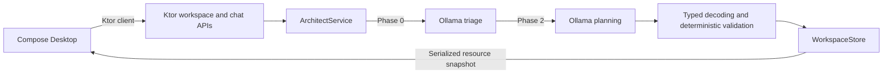

# Orchard

**Plant intent, harvest software.**

Orchard is a local-first engineering workspace for turning natural-language intent into governed, evidence-producing software workflows. Its current MVP combines a Compose Desktop project center, a Ktor backend, deterministic workflow validation, and local inference through Ollama.

> **Project status:** Milestone 1 complete - Local Architect MVP. The Architect creates projects, epics, stories, tasks, and bugs, including dependent entities in one request. Workspace persistence and downstream agent execution remain future work.

## Milestone 1: Local Architect MVP

This milestone establishes Orchard's first complete local workflow: describe delivery intent in the desktop application, interpret it with `phi3:mini`, validate it against deterministic Kotlin policy, and render the resulting hierarchy without a cloud service.

Delivered and verified:

- Compose Desktop project, epic, story, task, and bug views.
- Multiline Architect input with Ctrl+Enter submission.
- Typed Ktor APIs and `kotlinx.serialization` JSON contracts.
- Two-phase local Ollama triage and planning through a suspendable Ktor client.
- Request-local Architect execution with single-flight concurrency protection.
- Deterministic preservation of explicit titles, descriptions, and parent IDs.
- Atomic plans of up to eight ordered operations.
- Default Delivery hierarchy enforcement: `Project -> Epic -> Story -> Task/Bug`.
- Automatic `General` epic creation when a new project and story omit an epic.
- Kotlin-owned IDs, hierarchy normalization, and rollback.
- Local application directories beneath `~/.orchard`.
- Backend and frontend regression suites run through `./gradlew build`.
- Live Ollama verification covers non-streaming JSON requests and exact single-intent creation.

Milestone boundaries:

- Workspace state holds at most 32 entities in process memory.
- Restarting the backend clears the board.
- Create is the only applied action; update, delete, and query are classified but rejected.
- Ollama must be running locally with `phi3:mini` installed.
- Filesystem-native state, evidence derivation, and downstream agent execution begin after this milestone.

## Architecture



Orchard has two Gradle modules:

- `frontend`: Compose Desktop UI, ordinary Compose state, and a typed Ktor client.
- `backend`: Ktor servers, Architect orchestration, workflow policy, in-memory workspace state, and the Ollama client.

The backend exposes:

- `GET http://127.0.0.1:8085/api/workspace`
- `POST http://127.0.0.1:8086/api/architect/chat`

The chat request is `{ "prompt": "..." }` with a 4092-byte UTF-8 limit. Both APIs return the same resource envelope, including non-success chat responses such as `409`, `422`, and `503`.

## Key Decisions

| Area | Decision |
| --- | --- |
| Runtime | Use conventional Kotlin, Ktor, coroutines, and serialization. |
| UI | Use Compose state and lifecycle-aware client disposal. |
| LLM | Treat Ollama output as untrusted input that must pass typed decoding and deterministic validation. |
| Multi-intent | Let the model propose at most eight operations; Kotlin assigns IDs and commits or rolls back the batch. |
| Authority | Keep hierarchy and workflow policy outside the model. |
| Storage | Make human-readable filesystem records authoritative; indexes and embeddings are derived. |
| Prompts | Keep system prompts as versioned resources. |

See [docs/adrs](docs/adrs) for the decision history and proposed filesystem intelligence, workflow, and model-routing architecture.

## Requirements

- Linux, macOS, or Windows with a Compose Desktop-compatible environment.
- JDK 23 recommended. Kotlin `2.1.21` falls back to JVM target 23 when run with JDK 26.
- `curl` for the combined launcher readiness check.
- Ollama on `127.0.0.1:11434` with `phi3:mini` installed.

## Run

Launch the complete application:

```bash
./run_orchard.sh
```

Or start each module separately.

Start the backend:

```bash
./gradlew :backend:jvmRun --no-daemon
```

Start the desktop application in another terminal:

```bash
./gradlew :frontend:desktopRun --no-daemon
```

Compile and test without launching:

```bash
./gradlew build --no-daemon
```

Example creation sequence:

```text
Create a project named Aurora.
Create an epic named Authentication in project ID 1.
Create a story named Email sign-in in epic ID 2.
Create a task named Implement login form in story ID 3.
```

Dependent entities can be created atomically:

```text
Create a project named Atlas, create a story named Import market data, and create two tasks named Parse feed and Validate sequence numbers.
```

The Default Delivery workflow materializes this as `Atlas -> General -> Import market data -> Parse feed / Validate sequence numbers`. A validation failure rolls back the entire plan.

## Local Data

Backend startup creates:

```text
~/.orchard/
|-- db/
|-- projects/
`-- rag-shared/
```

These directories are runtime state and are not part of the repository.

## Next Milestones

- **Milestone 2 - Filesystem authority:** persist and recover workspace records through a checksummed journal and snapshots.
- Add status transitions for tasks and bugs.
- Derive project observations, candidate practices, and executable workflows from evidence.
- Add role-based agent runs and evidence-based model routing.
- Implement concrete classifier, chunker, embedder, and vector-index adapters.