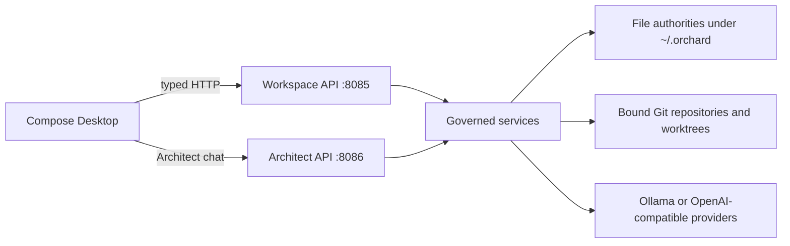
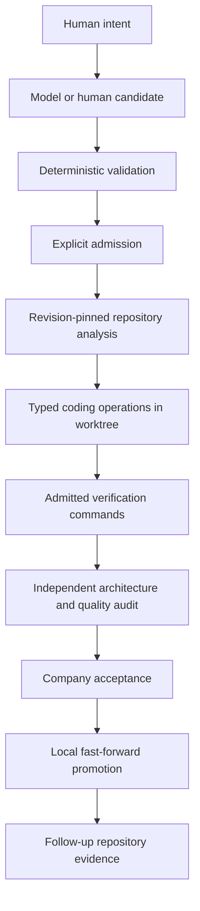

# Architecture

## Runtime Shape

Orchard is a local desktop application with one backend process and one Compose Desktop process.

`OrchardApplication.kt` is the backend composition root. It initializes paths, constructs file-backed stores, composes services, launches periodic workers, and starts two loopback-only Ktor Netty servers.

## Module Boundaries

### Backend

The backend owns authority and mutation.

- `workspace`: entity hierarchy, workflow memory, definitions, plans, dispatch, design, genesis, and repository bindings.
- `company`: company state, staffing, orchestration, independent audits, and local promotion.
- `analysis`: broad repository analysis and revision-pinned execution plans.
- `agent`: typed coding operations, worktree application, verification, and repository context collection.
- `standards`: project standards, conformance scans, remediation campaigns, and resolution cases.
- `vector`: provider catalog, model profiles, provider clients, and routing.
- `resource`: machine telemetry, policy, and execution leases.
- `config`: local storage roots.

The `api`, `domain`, `compilation`, `storage`, `service`, and `ipc` packages contain supporting boundaries and earlier platform capabilities. New behavior should attach to the authority that owns its invariant, not merely the nearest route.

### Frontend

The frontend is a projection and command surface. `DesktopNetworkClient` owns typed HTTP integration. `OrchardCircuitBinder` loads state and issues commands. Compose views render backend truth and local edit buffers.

Do not put authoritative transition logic in Compose. A disabled button can improve usability, but the backend must independently validate every request.

## Authority Flow

The principal delivery flow is:

Each arrow is a boundary with its own record and failure state. Avoid helper methods that collapse proposal, admission, execution, and acceptance into one mutation.

## Background Workers

The backend starts supervised coroutine loops at one-second intervals for:

- eligible circuit dispatch;
- repository analysis;
- governed coding;
- independent audit; and
- remediation campaign and resolution reconciliation.

Manual tick endpoints exist for selected workers and tests. Production correctness must be idempotent because a process can stop after an external mutation but before its corresponding ledger append. Resolution admission, promotion, and campaign reconciliation therefore match durable evidence before creating successors or recording completion.

## Repository Boundary

Orchard binds canonical local Git roots. Dispatched work uses isolated managed worktrees. Repository context collection reads tracked text, ranks evidence by query relevance and foundation weight, and applies bounded byte/file budgets.

Foundation context includes root governance files such as `README.md`, `ROADMAP.md`, and tracked documentation under `docs/`. Foundation weight improves selection but does not waive context limits or content-hash pinning.

## Model Boundary

Model calls are routed through named execution profiles and provider bindings. Services provide bounded prompts and expect structured JSON. Outputs are decoded into candidate envelopes, checked for shape, IDs, hashes, coverage, and policy, then either returned for explicit admission or used within an already admitted bounded operation.

Never treat successful JSON decoding as sufficient validation.

## Failure Model

Orchard generally fails closed:

- malformed requests return 4xx responses;
- stale revisions and dirty repositories block mutation;
- model/resource/storage failures do not invent success records;
- committed-prefix ledger corruption stops replay;
- a malformed final JSONL append may be quarantined where the store uses recoverable replay; and
- interrupted operations reconcile from durable repository/workspace evidence.

See [Persistence and Recovery](persistence.md) for store-level rules and [ADRs](../adrs/) for the decisions behind these boundaries.
